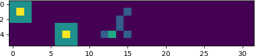
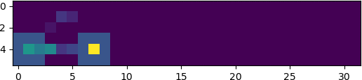

# Abstract
Orchard harvest-aid platforms are used in high-density orchards with SNAP (Simple, Narrow, Accessible, and Productive) tree architectures. In these orchards, trees are planted and trained into fruiting walls, and workers harvest the fruit while standing on the platform. A worker in the front – the “driver” - is responsible for controlling the platform speed and keeping it centered in the row while they pick fruit. The use of harvest-aid platforms improves the picking efficiency, safety, and ergonomics of the workers compared to ladder-based picking. However, the non-uniform fruit distribution in tree canopies results in an incoming fruit rate (demand for labor) that varies spatially and temporally and is not necessarily matched to the workers' picking positions and harvest speeds (supply of labor). This mismatch lowers the overall harvest efficiency. A previous study improved upon this mismatch by introducing an independent actuated lift for each worker and dynamically adjusting each worker's picking height based on the estimated incoming fruit distribution and the workers’ harvesting rates. The horizontal moving speed of the platform was not controlled. This work presents an integrated system that optimizes the platform's travel speed and lift heights in real-time to increase the platform’s harvest throughput. Simulation experiments using digitized fruit distributions investigated the algorithm's potential gain under different settings. Field experiments were performed in a commercial apple orchard in Lodi, CA, with Fuji apples on V-trellised trees using a “robotized” platform and two workers. Two modes were implemented in the experiments: the “conventional” mode, which represents current practice, where workers' heights are fixed, and the platform speed is adjusted by the front worker, and the “co-robotic” mode, where the optimizing algorithm dynamically adjusts worker's heights and platform speed. A total of 3,227 kg of apples were harvested during the experiment. The overall throughput of the “co-robotic” mode was 261.8 kg/h if apple stems were clipped and 501.1 kg/h if apple stems were not clipped. The corresponding overall throughputs of the “conventional” mode were 235.3 kg/h and 397.7 kg/h. The results showed that the “co-robotic” mode improved the harvesting throughput by 11 % (clipping) and 25 % (without clipping)

# Paper 
[A robotic orchard platform increases harvest throughput by controlling worker vertical positioning and platform speed](https://www.sciencedirect.com/science/article/pii/S0168169924001261)  
*Fei, Z., & Vougioukas, S. G. (2024). A robotic orchard platform increases harvest throughput by controlling worker vertical positioning and platform speed. Computers and Electronics in Agriculture, 218, 108735.*

# Dependency
```bash
pip install -r requirements.txt
```

# Compile simulator
Some cython extensions are used by simulator so need to compile them
``` bash
cd simulator
python setup.py build_ext --inplace
``` 

# Demo 
Check demo.ipynb to play with 4 platform operation modes

# Import simulator
```python
from simulator.appleSimulator import appleSimulator
```

# Four operational modes running at the same fruit distribution
Mode 1: Height and speed fixed mode 



Mode 2: Speed-optimized mode 


Mode 3: Height-optimized mode 



Mode 4: Full co-robotic mode 


# Convert image to gif to show the whole picking process
```bash
cd /results/modex/
convert *.png animation.gif
```
